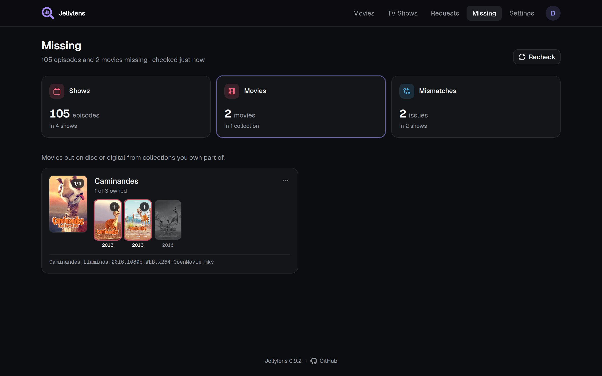

<div align="center">


# Jellylens

**See what's missing from your Jellyfin library.**

Browse your movies and shows, find missing episodes and seasons, complete
your movie collections, catch bad TMDB matches, and keep a wishlist of what
to add next.

[](https://github.com/nicestdev/jellylens/actions/workflows/docker.yml)
[](https://github.com/nicestdev/jellylens/pkgs/container/jellylens)
[](LICENSE)


</div>

## Features

- 🎬 **Library overview**: poster grids for movies and shows. Search, sort, and filter by genre, audio language or airing status.
- 🧩 **Missing episodes**: gaps, whole missing seasons and seasons that are still airing, all checked against TMDB. Ignore anything you don't care about.
- 🎞️ **Movie collections**: for every TMDB collection you own part of (*The Lord of the Rings*, *Bourne*, …), the movies you don't have yet. Only those out on disc or digital count, and each one can be requested right from its card. Optionally shows the file names you own, so you can get the rest from the same release group.
- 🔍 **Mismatch detection**: episodes and seasons TMDB doesn't know about, usually a wrong match or a duplicate file.
- 🗣️ **Language coverage**: flags shows where only some seasons have your audio language.
- 📝 **Requests**: search TMDB or browse what's trending and keep a wishlist. Titles you own are marked, and requests switch to *Available* when they show up in Jellyfin. Everyone has their own list; admins see all of them, most wanted first.
- 🔐 **Jellyfin sign-in**: log in with your Jellyfin account. Missing and Settings are for Jellyfin admins only.
- 🔄 **Automatic sync**: Jellyfin and TMDB refresh on a schedule you set with environment variables; the Settings page shows it and lets you sync right away.
- 📱 **Works on any device**: responsive, dark UI that works on desktop and phone.

<details>
<summary><b>More screenshots</b></summary>
<br/>

| Movies | TV Shows |
| :---: | :---: |
|  |  |
| **Requests** | **Movie collections** |
|  |  |
| **Settings** | |
|  | |

</details>

## Installation

```yaml
services:
  jellylens:
    image: ghcr.io/nicestdev/jellylens:latest
    container_name: jellylens
    environment:
      JELLYFIN_URL: http://192.168.1.10:8096
      JELLYFIN_API_KEY: your_jellyfin_api_key
      TMDB_API_KEY: your_tmdb_api_key
    volumes:
      - ./data:/app/data
    ports:
      - 3000:3000
    restart: unless-stopped
```

Available for `linux/amd64` and `linux/arm64`.

## Configuration

| Variable | Required | Default | Description |
| --- | :---: | :---: | --- |
| `JELLYFIN_URL` | ✅ | | Address of your Jellyfin server, as seen from the container |
| `JELLYFIN_API_KEY` | ✅ | | Jellyfin API key (*Dashboard → API Keys*) |
| `TMDB_API_KEY` | ✅ | | [TMDB API key](https://www.themoviedb.org/settings/api) (v3) |
| `JELLYFIN_SYNC_INTERVAL_HOURS` | | `6` | Hours between Jellyfin library syncs, `0` = off |
| `TMDB_SYNC_INTERVAL_HOURS` | | `24` | Hours between TMDB metadata refreshes, `0` = off |
| `MISSING_RECHECK_INTERVAL_HOURS` | | `24` | Hours between rechecks for missing episodes and movies, `0` = off |
| `AUTH_ENABLED` | | `true` | Sign in with Jellyfin accounts; `false` opens Jellylens to anyone who can reach it |

All data (library cache, posters, requests, display settings) is stored in `/app/data`.

### Exposing Jellylens to the internet

Jellylens is built to sit behind a reverse proxy or a Cloudflare Tunnel:

- Keep `AUTH_ENABLED` on. Sessions last 7 days and are checked against Jellyfin on every request, so disabling or deleting a user in Jellyfin locks them out within a minute.
- Failed sign-ins are limited to 5 per 15 minutes per IP and per username. Jellylens reads the client IP from `CF-Connecting-IP` (Cloudflare) or `X-Forwarded-For`, so don't also expose the container port directly.
- Serve it over HTTPS; the session cookie is then marked `Secure` automatically.
- Jellyfin locks accounts itself after repeated wrong passwords. For extra protection, add a Cloudflare rate-limiting rule for `/api/auth/login` or put Cloudflare Access in front.

#### With a Cloudflare Tunnel

1. In the Cloudflare dashboard, go to *Zero Trust → Networks → Tunnels*, create a tunnel of type *Cloudflared* and copy its token.
2. Add a public hostname to the tunnel, e.g. `jellylens.example.com`, pointing to the service URL `http://jellylens:3000` (the compose service name; plain `http`, Cloudflare handles HTTPS).
3. Run `cloudflared` next to Jellylens. Jellylens needs no `ports:` then: it's only reachable through the tunnel.

```yaml
services:
  jellylens:
    image: ghcr.io/nicestdev/jellylens:latest
    container_name: jellylens
    environment:
      JELLYFIN_URL: http://192.168.1.10:8096
      JELLYFIN_API_KEY: your_jellyfin_api_key
      TMDB_API_KEY: your_tmdb_api_key
    volumes:
      - ./data:/app/data
    restart: unless-stopped

  cloudflared:
    image: cloudflare/cloudflared:latest
    container_name: cloudflared
    command: tunnel --no-autoupdate run
    environment:
      TUNNEL_TOKEN: your_tunnel_token
    depends_on:
      - jellylens
    restart: unless-stopped
```

Both services share the compose network, so the tunnel reaches Jellylens by its service name. If you also want to open it at home without the tunnel, publish the port on your server's LAN address only (e.g. `192.168.1.20:3000:3000`), and make sure your router doesn't forward it.

## Development

```bash
cp .env.example .env
docker compose -f docker-compose.dev.yml up -d   # next dev, hot reload
docker compose up -d --build                     # local production build
```

The app is a Next.js project in [`nextapp/`](nextapp). The README screenshots
come from a fake Jellyfin with a free demo library, see [`docs/demo/`](docs/demo).

## License

[MIT](LICENSE)
