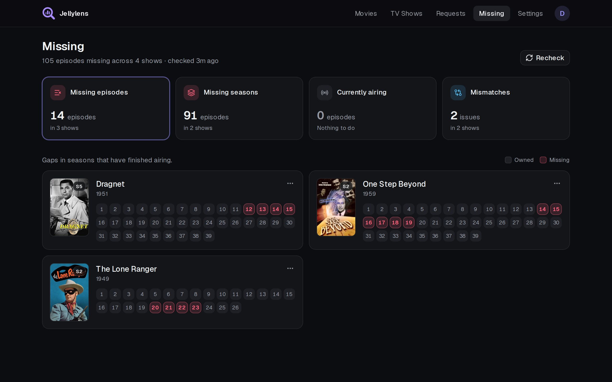
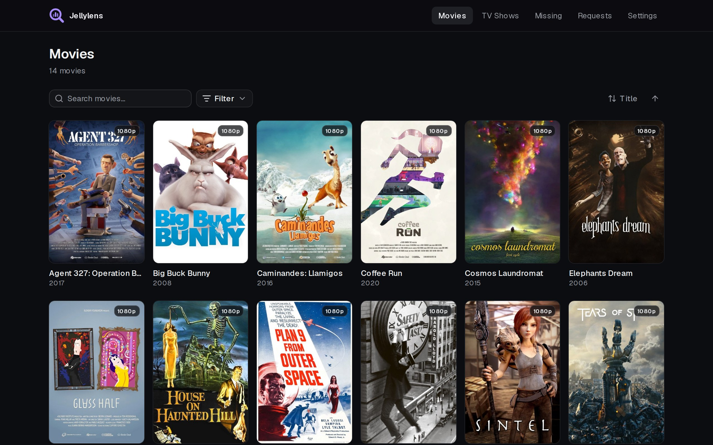
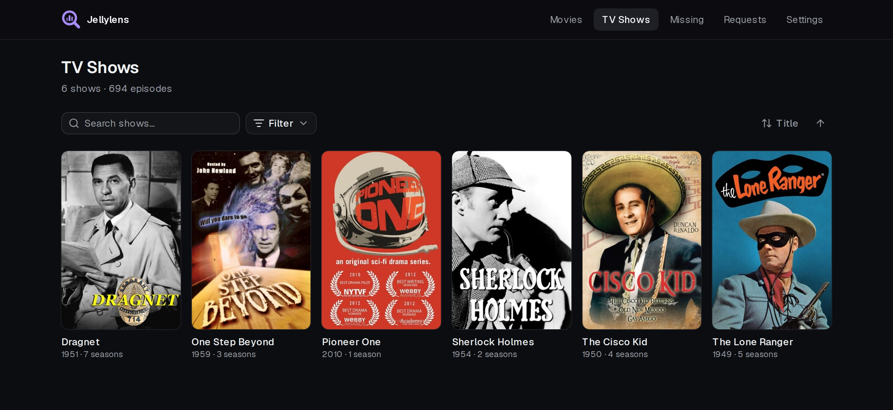
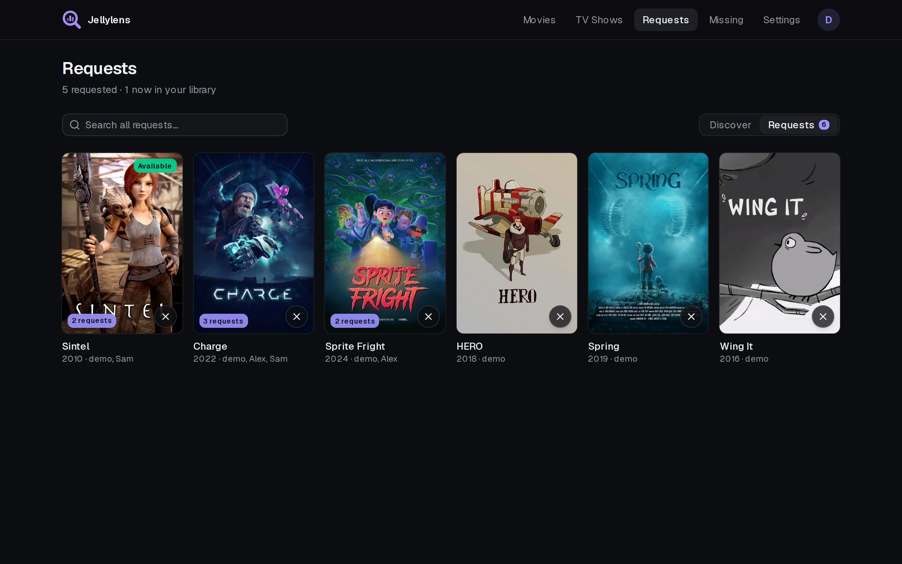
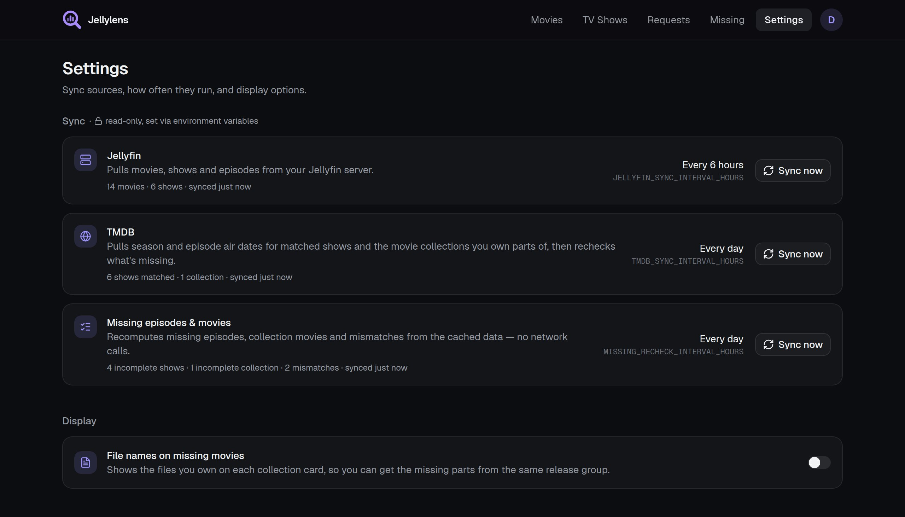

<div align="center">


# Jellylens

**See what's missing from your Jellyfin library.**

Browse your movies and shows, find missing episodes and seasons, catch bad
TMDB matches, and keep a wishlist of what to add next.

[](https://github.com/nicestdev/jellylens/actions/workflows/docker.yml)
[](https://github.com/nicestdev/jellylens/pkgs/container/jellylens)
[](LICENSE)



</div>

## Features

- 🎬 **Library overview**: poster grids for movies and shows. Search, sort, and filter by genre, audio language or airing status.
- 🧩 **Missing episodes**: gaps, whole missing seasons and seasons that are still airing, all checked against TMDB. Ignore anything you don't care about.
- 🔍 **Mismatch detection**: episodes and seasons TMDB doesn't know about, usually a wrong match or a duplicate file.
- 🗣️ **Language coverage**: flags shows where only some seasons have your audio language.
- 📝 **Requests**: search TMDB or browse what's trending and keep a wishlist. Titles you own are marked, and requests switch to *Available* when they show up in Jellyfin. Everyone has their own list; admins see all of them, most wanted first.
- 🔐 **Jellyfin sign-in**: log in with your Jellyfin account. Missing and Settings are for Jellyfin admins only.
- 🔄 **Automatic sync**: Jellyfin and TMDB refresh on a schedule you set on the Settings page.
- 📱 **Works on any device**: responsive, dark UI that works on desktop and phone.

<details>
<summary><b>More screenshots</b></summary>
<br/>

| Movies | TV Shows |
| :---: | :---: |
|  |  |
| **Requests** | **Settings** |
|  |  |

</details>

## Installation

```yaml
services:
  jellylens:
    image: ghcr.io/nicestdev/jellylens:latest
    container_name: jellylens
    environment:
      JELLYFIN_URL: http://192.168.1.10:8096
      JELLYFIN_API_KEY: your_jellyfin_api_key
      TMDB_API_KEY: your_tmdb_api_key
    volumes:
      - ./data:/app/data
    ports:
      - 3000:3000
    restart: unless-stopped
```

Available for `linux/amd64` and `linux/arm64`.

## Configuration

| Variable | Required | Default | Description |
| --- | :---: | :---: | --- |
| `JELLYFIN_URL` | ✅ | | Address of your Jellyfin server, as seen from the container |
| `JELLYFIN_API_KEY` | ✅ | | Jellyfin API key (*Dashboard → API Keys*) |
| `JELLYFIN_PUBLIC_URL` | | `JELLYFIN_URL` | Address your browser uses for "Open in Jellyfin" links |
| `TMDB_API_KEY` | ✅ | | [TMDB API key](https://www.themoviedb.org/settings/api) (v3) |
| `JELLYFIN_SYNC_INTERVAL_HOURS` | | `6` | Hours between Jellyfin library syncs, `0` = off |
| `TMDB_SYNC_INTERVAL_HOURS` | | `24` | Hours between TMDB metadata refreshes, `0` = off |
| `MISSING_RECHECK_INTERVAL_HOURS` | | `24` | Hours between missing-episode rechecks, `0` = off |
| `AUTH_ENABLED` | | `true` | Sign in with Jellyfin accounts; `false` opens Jellylens to anyone who can reach it |

All data (library cache, posters, requests, settings) is stored in `/app/data`.

## Development

```bash
cp .env.example .env
docker compose -f docker-compose.dev.yml up -d   # next dev, hot reload
docker compose up -d --build                     # local production build
```

The app is a Next.js project in [`nextapp/`](nextapp).

## License

[MIT](LICENSE)
